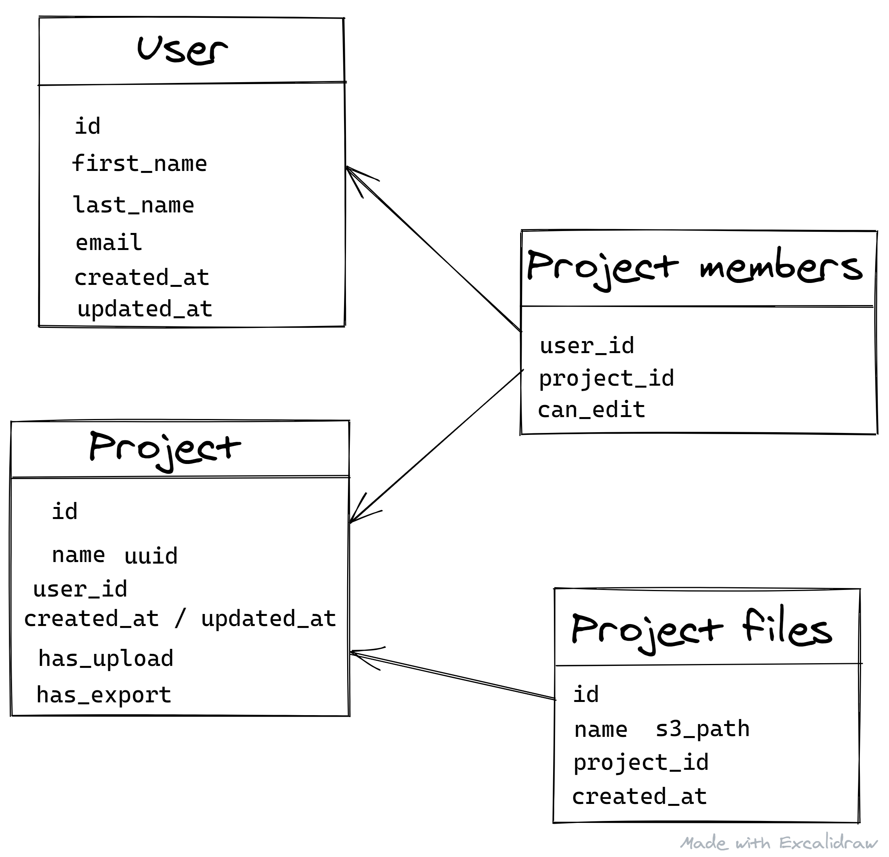

During the last month of staying at home at practicing social distancing has given me ample time to play around with Hasura and serverless environments to challenge myself into building a Subscription based application platform using as less backend code as possible. By backend code I mean the typical CRUD workflow but also auth handling, payments registration, authorization and task handling.

As i am building this I am documenting the most common issues and architectural challenges I am facing while also providing answers into some of the questions I have been Google or discord channels! This series of articles will be less of a tutorial and more of a public note taking that other can read and build upon.

## What I am building

First thing to get out is a rough idea of what I am building. And rough because it could be generic enough to be applied in many scenarios but abstract enough to actually refer into a product. A sort of boilerplate or skeleton.

The whole idea is around users, projects, project members and various project workflows (be it upload files, convert images, exporting projects into something readable). A few of the requirements we could setup are:

- users can create and select projects
- users can invite other users to collaborate on projects
- projects have paid features available if the project owner is paying for a specific feature or a bundle of features
- project members should know who the project creator is without getting access into other user sensitive data (email, billing etc)

This gives a good skeleton to work with and I believe shares many requirements of typical Saas platforms.

## Choice of tooling

With the choice of building this in the serverless environment and with as less backend code as possible, Hasura was pretty much the only real choice. It provides a wide range of features to work with authorization, permissions, queries, mutations and so on. I contemplated using Prisma for something like this but I would still need to build a lot of backend code on my own even if they give a very nice querying layer from the get go.

The only other real choice was how to handle authentication since Hasura doesn't handle that part of the stack. I spent a couple of days going through Cognito and Auth0 and even if the pricing of Auth0 is way bigger it comes with better frontend integrations, better documentations and all-in-all better features. This choice was also involved by how easy would be build the frontend of the auth layer. With cognito even if amplify seems to be making nice strides towards unifying and tidying the experience, the docs just didn't feel compelling and I would need more code to handle authentication than I was ready to spend on.

So the general stack looks like:

- AWS for postgres hosting and the hasura server. Any lambdas would also go in here.
- Hasura handles authorization layer along with typical CRUD queries in the tables.
- Auth0 handles the authentication providing the frontend JWT tokens to forward to Hasura.

Frontend would be React because this is what I am most familiar with even if the choice isn't consolidated at the moment.
And finally payments and plans would probably be with Stripe. I haven't yet used Stripe subscriptions and the logic here might be a bit flawed and should evolve as I explore solutions and test implementations. Learning in public!

## Scaffolding Hasura tables

So first things I needed to do is design the database architecture. Hasura provides a great UX doing so on their graphql engine UI. Adding table fields, configuring relations, viewing and manually inserting/updating data is a breeze.

What was hard to grasp was the mental model around the permissions and roles. Coming from a full stack environment I was used to creating authorization workflows based user type, handling access based on the REST endpoints and well this was not always beautiful but it served its purpose. The difference with Hasura is that you need to think about the database structure before jumping into implementations and as you implement authorizations there's a lot of trial and error around it, especially when not being familiar with Hasura. At the beginning everything felt weird and complicated but the more I was digging in the view was getting clearer. At the end and as soon as you start thinking like Hasura everything clicks! And its beautiful.

Here's the final stage of the tables as of right now! The choice would be explained further bellow.



Everything here looks pretty straightforward and the only thing that might picked my interest and spent some time debating myself on how to do is where to store information whether a project is allowed to upload files or export files. Since the whole plans, products and subscriptions handling would happen on Stripe there were two solutions

- store subscription information in the user table and deduce project access through the owner
- store each project feature access on the project itself

The reason I opted for the second solution is because the permissions handling is much much easier. When user subscribes for features A then automatically turn this feature on for all of their project. Similarly when user cancels their subscription then turn the features off. This way if User B is collaborating with User A on project A then we don't necessarily care whether User B is paying. Only source of truth is what is happening in the project. The inverse is the same. Somebody who is paying a feature but is invited to work on a project without this feature on shouldn't have access to it.

Turning those features on and off would be easy with Stripe webhook since we would listen on the specific subscription changes flow. Only question left is how to set these features during project creation. And the most plausible solution for this right now is to make use of [Hasura event triggers](https://hasura.io/docs/1.0/graphql/manual/event-triggers/index.html). I haven't touched that part yet so can't talk about a solution but seems like the best case for handling such side effects!

## Setting up Hasura roles working through authorizations

### User table

User permissions are the easiest since Insert and Delete will be handled by Auth0. What's interesting here is how to handle Select and Update permissions for the user and fortunately this would be pretty straight forward, we allow a user to select and update only their own profile `{"id":{"_eq":"X-Hasura-User-Id"}}`.
We also need to make sure that the user can only update their `first_name` and `last_name` or eventually other metadata not related to the authentication flow such as `email` or `id`. For the id I also opted for a less conventional approach using `id - text, primary key, unique` instead of an auto-increment approach since that id needs to correspond to the auth0 id to facilitate the flow.

When the user logs in they receive a JWT token that will have an `X-HASURA-USER-ID` claim equal to their auth0_id. More details on the authentication would follow on another article along with details on how to keep in sync the auth0 users with the Hasura table and the whole frontend bootstrap. [Hasura docs](https://hasura.io/docs/1.0/graphql/manual/guides/integrations/auth0-jwt.html) already covers this up if you are impatient!

### Project table

On to something fairly trickier and where the Hasura mental model both shines and shows that it might be not trivial at first sight! There are a few things that need to be taken care off, from the trivial allow a user to view only projects they own or they are member to something like allow a user to create a project force them to be the owner and the project member.

Starting with the easiest first, Select. Since we will be having every project member, even owner, in the project_members the permission is as simple as

```json
{ "project_members": { "user_id": { "_eq": "X-Hasura-User-Id" } } }
```

Nothing more fancy here unless you want to limit project members getting at private user data! [Luckily Hasura has us covered again!](https://hasura.io/docs/1.0/graphql/manual/auth/authorization/role-multiple-rules.html)

Equally simple is Update and Delete `{"user_id":{"_eq":"X-Hasura-User-Id"}}` since this is the reason we have the user_id foreign key there. If we wanted it to be a bit more feature-full then we could make use of the can_edit field in members and allow other users to edit a project. It would look like

```json
{
  "project_members": {
    "_and": [
      { "user_id": { "_eq": "X-Hasura-User-Id" } },
      { "can_edit": { "_eq": true } }
    ]
  }
}
```

Something to also keep in mind is what to allow a user to edit. They should be allowed to change the name of the project and maybe other user related metadata that a project could have but feature flags, created_at / updated_at or ids are of the bat! And that is super easy to do using the column permissions on Hasura.

And finally Insert. At the beginning i thought hey this is easy, no need for any checks any user should be able to create a project we just need to make sure that when a user creates a project the user_id is assigned automatically to them. And that is again pretty simple with column presets. Setting up user_id to be a preset from the `X-Hasura-User-Id` session variable.

The problem really started when I needed to add the user in the project_members automatically at the project creation. I couldn't use any preset since a user should be allowed to also add other users in the project_members. First solution I came up with was passing the user_id in the mutation. Looked like:

```graphql
mutation insert_project {
  insert_example_project(
    objects: {
      name: "A cool name"
      project_members: { data: { user_id: "auth0|user_id" } }
    }
  ) {
    returning {
      id
      name
      project_members {
        project_id
        user_id
      }
    }
  }
}
```

This solution was flawed because that user_id in the mutation could have been user selected and abused.

Enter roles. Up until now I couldn't understand how roles came into play. Sure having admin and user was making sense since admin had superpowers but how would I use other roles? Well turns out it makes sense for this case. Hence introducing a new role project_creator that is going to be used at project creating. User role won't be able to create a project and that's perfect!
The project_creator would have permission to create a project allowed only to insert the name and automatically setting up the user_id with column presets.

And this would make more sense when using this role in project_members.

### Project_members

So following up on the project_creator role, the role is allowed to create any project_member but the user_id would be a column preset and they shouldn't be allowed to pick a project_id. The mutation to create a project would then become:

```graphql
mutation insert_project {
  insert_example_project(
    objects: {
      name: "A cool name"
      project_members: { data: { can_edit: true } }
    }
  ) {
    returning {
      id
      name
      project_members {
        project_id
        user_id
        can_edit
      }
    }
  }
}
```

🎉 Hasura takes care about the rest! Small note for this to work is to send `x-hasura-role` header and set it to `project_creator`!

The rest of the permissions are quite easy. The project_creator role does not need any more permissions unless you want to be returning the inserted project from the mutation.
As for the user role, we only need to make sure that the user adding another member in the project actually is the owner of the project. And to do this we can simply do

```json
{ "project": { "user_id": { "_eq": "X-Hasura-User-Id" } } }
```

We just need to make sure that project_members table has the object relation to project. Otherwise this wouldn't work and the project field wouldn't appear in the permission editor. And this would essentially be the same permission for the Select and Delete permissions. I don't think we need any Update authorizations. User only needs to add or remove users!

This might be due for a refactoring later since almost every time project_members would need to be invited and then them accepting the invitation. Shouldn't be hard to integrate since we can have has_confirmed boolean in the table. Maybe that wouldn't be enough

### Project feature table

So lastly we need a way to know whether a user can insert, select, update or delete in a table that actually depends on their subscription plan. Again starting from the easiest Select and Delete. We don't need to know if user is currently paying, as long as there are data in the table and we do this by verifying whether a user is in the project_members

```json
{
  "project": { "project_members": { "user_id": { "_eq": "X-Hasura-User-Id" } } }
}
```

For insert though we need to make an additional check for whether the corresponding feature flag is on! And all we need is the `_and` operator of the permissions engine

```json
{
  "project": {
    "_and": [
      { "project_members": { "user_id": { "_eq": "X-Hasura-User-Id" } } },
      { "has_feature": { "_eq": true } }
    ]
  }
}
```

And that's pretty much it in terms of permissions and CRUD building! First time going through this there are a lot of questions to be answered but there is not better feeling than clicking your way through a bulletproof solution. Time to focus next on integrating Auth0, keeping users in sync and putting some frontend in this project.

A great thanks to both @sajarora and @leoalves in the [Hasura Discord server](https://discordapp.com/invite/hasura) for their prompt answers on my questions!
